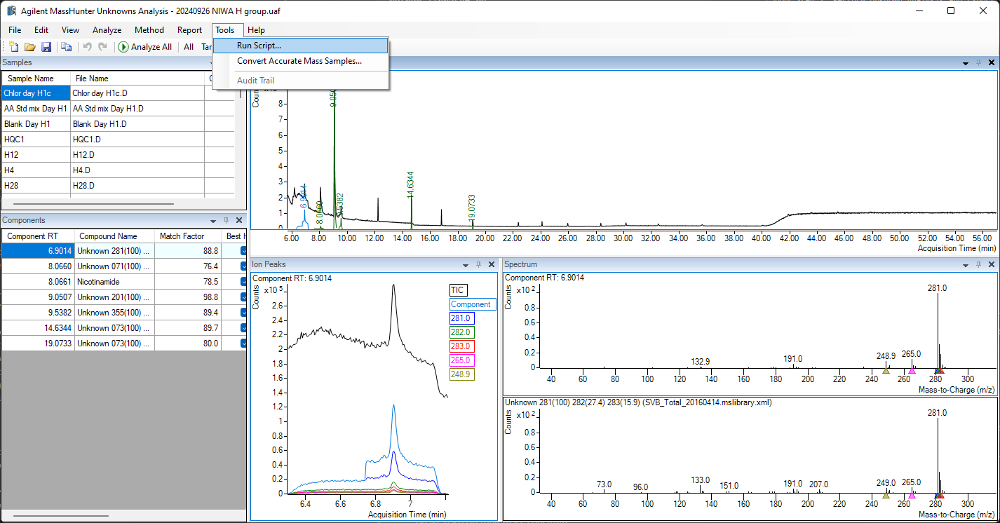
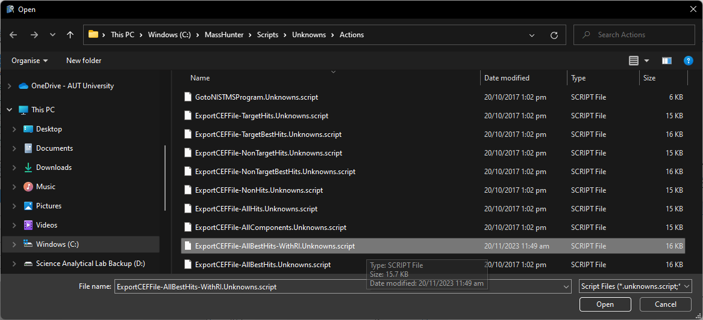
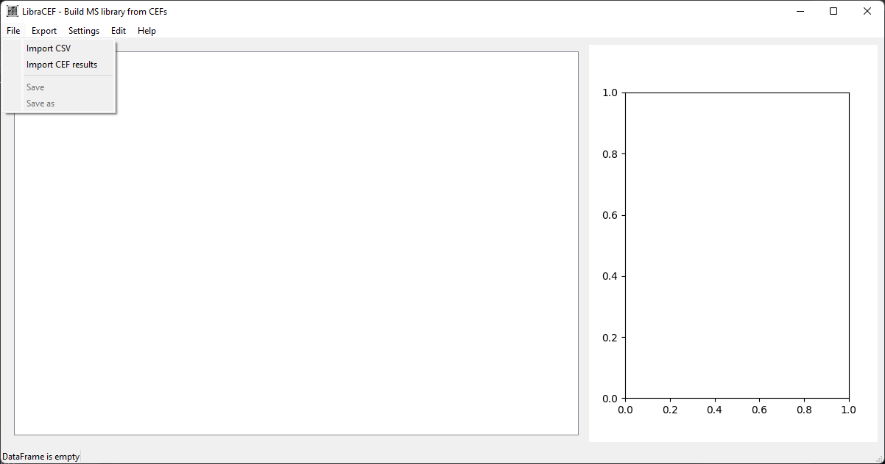
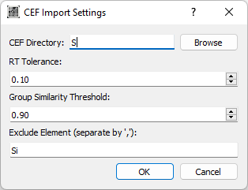
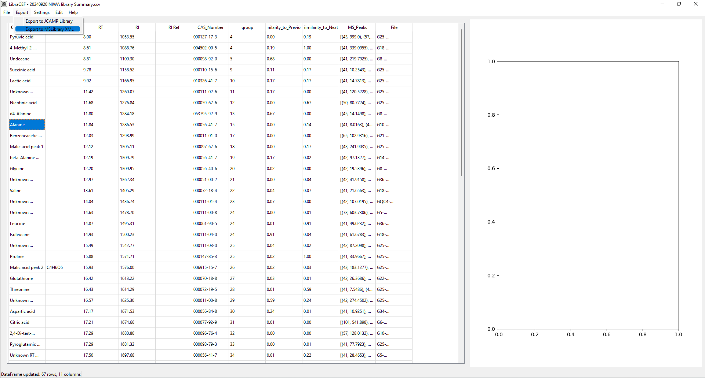

# Libracef: A Tool for Building Agilent Library Files from .cef Files of Mass Hunter Unknown Analysis.


## Table of Contents

* [Running the Application](#running-the-application)
* [Usage](#usage)
* [Troubleshooting](#troubleshooting)

## Running the Application

### Methond 1: Running using Binary
1. Download the zip file from the releases page. https://github.com/mzzzhunter/libracef/releases

2. Extract the binary to your preferred location.

3. Run the binary using libracef.exe.

### Method 2: Run the python code
1. git clone `https://github.com/mzzzhunter/libracef.git` or download the source code zip files.

1. Install dependencies
```bash
pip install -r requirements.txt 
```

2. Run libracef.py
```bash
python libracef.py
```
## Usage:

### To use the application, follow these steps:

1. Add the `Scripts\ExportCEFFile-AllBestHits-WithRI.Unknowns.script` file to the Mass Hunter Unknown Script folder. e.g. `C:\MassHunter\Scripts\Unkowns\Actions`

2. Perform unkonwn analysis of your samples.

3. Export the Best Hit Results to CEF files by go to menu bar Tools->Run Script. Select `ExportCEFFile-AllBestHits-WithRI.Unknowns.script`.


4. Run `libracef.exe`. 

5. Click File->Import CEF results


6. Browse to select the folder containing the CEF files from step 3. 

>* RT Tolerance: Difference in retention time (in min) to merage the same identification.
>* Group Similarity Threshold: The threshold to group adjacent peaks base on their mass spectrum.
>* Exclude element: Exclude the peak identification that contains the input element. e.g. Si, Cl

>>

7. Curate the compound list table by edit each row if needed by modifying the cells or deleting rows.

8. Export to Agilent MSLibrary XML by select Export->Export to MSLibrary XML


